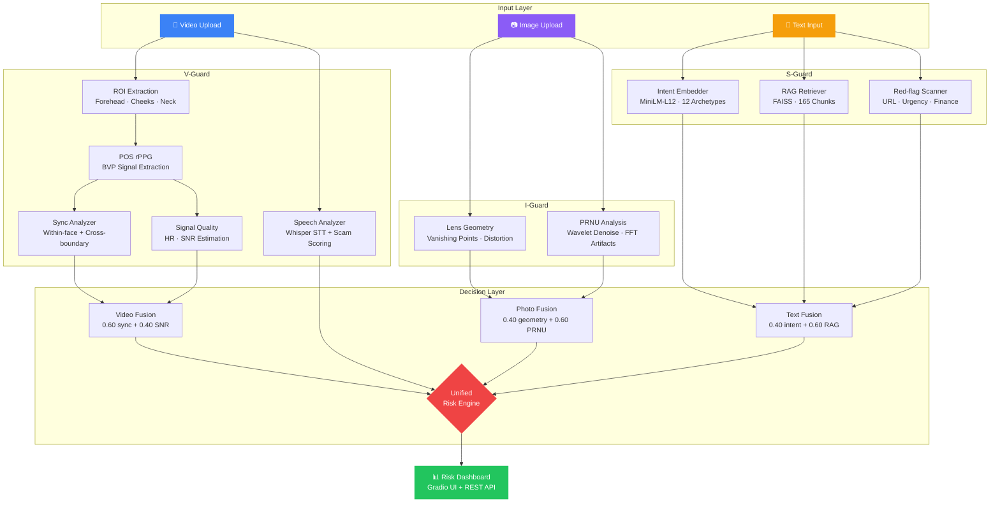

<p align="center">
  
</p>

<h1 align="center">🛡️ V.I.S.O.R.</h1>

<p align="center">
  <strong>V</strong>ideo, <strong>I</strong>mage, and <strong>S</strong>emantic <strong>O</strong>rigin <strong>R</strong>easoning
</p>

<p align="center">
  <em>Verifying the Physical Truth, Not the Simulated Illusion.</em>
</p>

<p align="center">
  <a href="https://www.python.org/"></a>
  <a href="LICENSE"></a>
  <a href="#"></a>
  <a href="#"></a>
  <a href="#"></a>
</p>

---

## 📋 Table of Contents

- [Introduction](#-introduction)
- [Key Features](#-key-features)
- [Architecture](#-architecture)
- [Tech Stack](#-tech-stack)
- [Installation](#-installation)
- [Usage](#-usage)
- [API Endpoints](#-api-endpoints)
- [Project Structure](#-project-structure)
- [Contributors](#-contributors)
- [References](#-references)
- [License](#-license)

---

## 🎯 Introduction

**V.I.S.O.R.** is a multi-modal anti-fraud defense framework designed to counter **Zero-day Fraud** — novel scam tactics powered by generative AI that evade traditional detection systems.

In 2026, tools like **SeeDance** enable real-time face-swapped video calls, AI-generated identity photos, and LLM-crafted phishing scripts. Rule-based filters and black-box classifiers cannot keep up. V.I.S.O.R. takes a fundamentally different approach: instead of learning to recognize fakes, it **verifies the presence of physical and physiological signals that generative models cannot reproduce**.

> **Core Principle:** A real human in front of a real camera produces involuntary biosignals (blood flow pulsation), optical artifacts (sensor noise fingerprints, lens distortion), and contextual coherence that no generative model can faithfully simulate. V.I.S.O.R. exploits this asymmetry.

---

## 🌟 Key Features

### 🎥 V-Guard — Video Deepfake Detection

Remote Photoplethysmography (rPPG) based spatiotemporal physiological consistency analysis.

- **POS Classical rPPG** — Extracts sub-dermal blood volume pulse (BVP) signals from forehead, cheeks, and neck ROIs without any training data
- **Cross-boundary Sync Analysis** — Detects face-swap artifacts by comparing physiological coherence between face and neck regions
- **Multi-person Timeline Heatmap** — Sliding-window analysis across video segments with per-person rPPG confidence visualization
- **Speech-aware Scam Scoring** — Integrates Whisper-based speech transcription with scam intent analysis

### 📷 I-Guard — AI-Generated Image Detection

Physics-grounded forensics that reads an image's "physical DNA" — no black-box classifier required.

- **PRNU Sensor Fingerprinting** — Extracts Photo-Response Non-Uniformity noise residuals via wavelet denoising (db4, 3-level) to identify camera-specific sensor patterns absent in AI-generated images
- **FFT Artifact Detection** — Identifies periodic upsampling grid artifacts in the frequency domain that betray GAN/diffusion model outputs
- **Lens Geometry Verification** — Analyzes vanishing-point consistency and radial distortion (barrel/pincushion) signatures unique to physical optics

### 📝 S-Guard — Scam Text Semantic Reasoning

Transformer embedding + Retrieval-Augmented Generation (RAG) for intent-level fraud detection.

- **12 Scam Archetype Matching** — Cosine similarity against curated intent embeddings covering investment fraud, romance/pig-butchering, government impersonation, parcel fraud, and more
- **FAISS-backed RAG Engine** — Retrieves from a 165-chunk anti-fraud knowledge base compiled from official government warnings and real-world scam transcripts
- **Red-flag Heuristics** — Pattern matching for suspicious URLs, urgency triggers, financial action keywords, and contact redirection tactics

---

## 📐 Architecture



---

## 🔧 Tech Stack

<p align="center">
  
  
  
  
  
  
  
  
</p>

| Category | Technologies |
|:---------|:-------------|
| **Deep Learning** | PyTorch 2.6, SentenceTransformers, Transformers |
| **Computer Vision** | OpenCV, MediaPipe, scikit-image, PyWavelets |
| **Signal Processing** | SciPy (Butterworth bandpass, FFT, peak detection) |
| **NLP / RAG** | HuggingFace MiniLM-L12, FAISS-CPU |
| **Audio** | faster-whisper, PyAV |
| **Backend** | FastAPI, Uvicorn, Pydantic v2 |
| **Frontend** | Gradio |
| **Media Fetch** | yt-dlp |

---

## 🚀 Installation

### Prerequisites

- Python 3.10+
- Git

### Setup

```bash
# Clone the repository
git clone https://github.com/your-org/visor.git
cd visor

# Create virtual environment
python -m venv venv
source venv/bin/activate  # Linux/macOS
# venv\Scripts\activate   # Windows

# Install dependencies
pip install -r src/requirements.txt

# Build the RAG index (first-time setup)
python -m src.training.build_rag_index
```

---

## 💻 Usage

### REST API Server

```bash
uvicorn src.main:app --host 0.0.0.0 --port 8000 --reload
```

API documentation is available at `http://localhost:8000/docs` (Swagger UI).

### Gradio Demo UI

```bash
python -m src.demo
```

### Run Tests

```bash
pytest
```

---

## 📡 API Endpoints

| Method | Endpoint | Description |
|:-------|:---------|:------------|
| `GET` | `/api/v1/health` | Health check — returns loaded model status |
| `POST` | `/api/v1/analyze/video` | Upload video for rPPG deepfake analysis |
| `POST` | `/api/v1/analyze/photo` | Upload image for PRNU + lens geometry analysis |
| `POST` | `/api/v1/analyze/text` | Submit text for scam intent + RAG analysis |
| `POST` | `/api/v1/analyze/unified` | Multi-modal analysis (video + image + text) |

### Quick Example

```bash
# Analyze a video for deepfake indicators
curl -X POST http://localhost:8000/api/v1/analyze/video \
  -F "file=@suspect_call.mp4"

# Analyze text for scam patterns
curl -X POST http://localhost:8000/api/v1/analyze/text \
  -H "Content-Type: application/json" \
  -d '{"text": "恭喜您中獎了！請提供銀行帳戶以領取獎金。"}'
```

---

## 📁 Project Structure

```
visor/
├── src/
│   ├── main.py                  # FastAPI application entrypoint
│   ├── config.py                # Central configuration & thresholds
│   ├── demo.py                  # Gradio interactive UI
│   ├── requirements.txt
│   ├── api/
│   │   ├── router.py            # Route registration
│   │   ├── schemas.py           # Pydantic request/response models
│   │   ├── video_endpoint.py
│   │   ├── photo_endpoint.py
│   │   ├── text_endpoint.py
│   │   └── unified_endpoint.py
│   ├── modules/
│   │   ├── video/
│   │   │   ├── video_detector.py    # rPPG pipeline orchestrator
│   │   │   ├── roi_extractor.py     # Face/cheek/neck ROI extraction
│   │   │   ├── signal_processor.py  # POS rPPG, bandpass, HR/SNR
│   │   │   ├── sync_analyzer.py     # Cross-region sync analysis
│   │   │   ├── timeline_analyzer.py # Multi-person segment heatmap
│   │   │   └── speech_analyzer.py   # Whisper STT + scam scoring
│   │   ├── photo/
│   │   │   ├── photo_detector.py    # Lens + PRNU fusion
│   │   │   ├── lens_geometry.py     # Vanishing points & distortion
│   │   │   └── prnu_analyzer.py     # Wavelet PRNU & FFT artifacts
│   │   └── text/
│   │       ├── text_detector.py     # Intent + RAG + red-flag fusion
│   │       ├── intent_embedder.py   # SentenceTransformer archetype matching
│   │       ├── rag_retriever.py     # FAISS retrieval engine
│   │       ├── scam_patterns.py     # 12 scam archetype definitions
│   │       └── red_flags.py         # Heuristic pattern scanner
│   ├── models/
│   │   ├── physformer_lite.py       # Lightweight rPPG Transformer
│   │   ├── rppg_model.py           # Quantum-inspired rPPG model
│   │   └── weights/
│   ├── data/
│   │   └── scam_corpus/            # RAG knowledge base (165 chunks)
│   ├── training/
│   │   ├── build_rag_index.py      # FAISS index builder
│   │   ├── train_rppg.py           # rPPG model training
│   │   └── ubfc_dataset.py         # UBFC-rPPG dataset loader
│   └── tests/
│       ├── test_api.py
│       ├── test_video.py
│       ├── test_photo.py
│       └── test_text.py
└── README.md
```

---

## 👥 Contributors

| Role | Member | Modules |
|:-----|:-------|:--------|
| **Lead A** — Physiological & Physical Forensics | `[電機碩一陳柏伸]` | V-Guard (Video rPPG), I-Guard (PRNU + Lens Geometry) |
| **Lead B** — Semantic Intelligence | `[電機碩二張善為]` | S-Guard (Intent Embedding, RAG Engine, Red-flag Heuristics) |

<sub>Lab605, Tatung University</sub>

---

## 📚 References

1. **rPPG-Toolbox** — Liu, X. et al. "rPPG-Toolbox: Deep Remote PPG Toolbox." *NeurIPS 2023 Datasets and Benchmarks Track*.
2. **POS Algorithm** — Wang, W. et al. "Algorithmic Principles of Remote PPG." *IEEE TBME*, 2017.
3. **PRNU Forensics** — Lukáš, J., Fridrich, J., Goljan, M. "Digital Camera Identification from Sensor Pattern Noise." *IEEE TIFS*, 2006.
4. **UBFC-rPPG Dataset** — Bobbia, S. et al. "Unsupervised Skin Tissue Segmentation for Remote Photoplethysmography." *Pattern Recognition Letters*, 2019.
5. **Sentence-BERT** — Reimers, N., Gurevych, I. "Sentence-BERT: Sentence Embeddings using Siamese BERT-Networks." *EMNLP 2019*.
6. **FAISS** — Johnson, J., Douze, M., Jégou, H. "Billion-scale Similarity Search with GPUs." *IEEE TBD*, 2021.

---

## 📜 License

This project is licensed under the [MIT License](LICENSE).

---

<p align="center">
  <sub>Built with conviction that <strong>physics cannot be faked</strong>.</sub>
</p>
